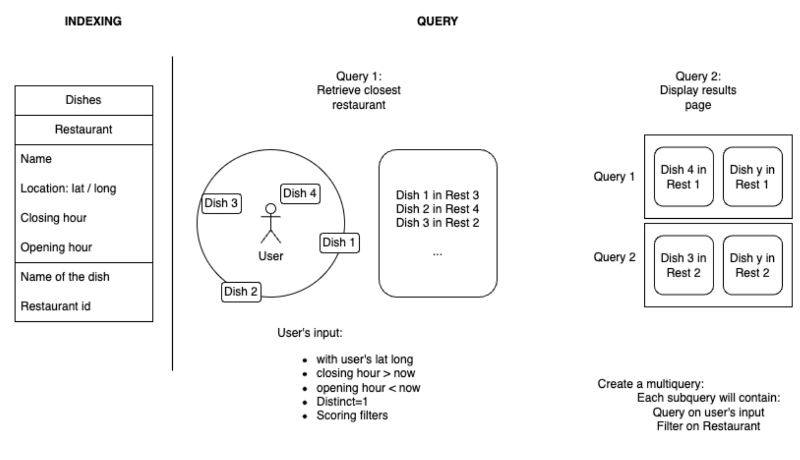
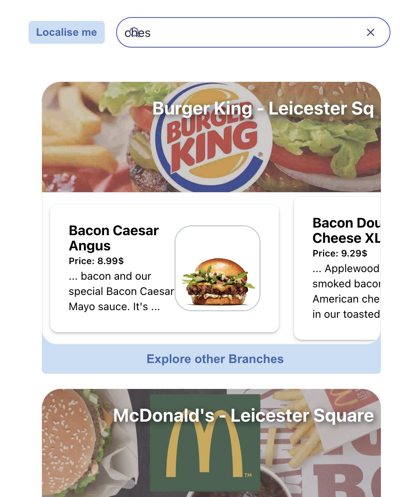

## PickMe Demo

> A solutions guid can be found [here made by Fiona Carbonell](https://docs.google.com/document/d/1svkqwJ1RdyWXH66BfaEpktXC8aCQ6uSeZ4gyCi0lUL8/edit)

The diagram below shows how to index and query dishes in a way that aggregates by restaurant. Using a [backend](https://www.algolia.com/doc/guides/building-search-ui/going-further/backend-search/in-depth/backend-instantsearch/react/) to process the initial query used to create a multiquery that finds the dishes in each restaurant that matches the query.

Dishes are indexed with restaurant objects. The `distinct` attribute is set to `true`, grouping by `restaurantID`.

This involves a sequence of two query steps:
1. Query dishes and receive a set of different restaurants using geoloc.
2. Multiquery with the original query filtered by restaurant and `distinct: false` to get all dishes from that restaurant.



Below you can see the preview of the app:

<div style="text-align: center;">

</div>

## Setup
```bash
git clone https://github.com/oscell/PickMe_Algolia_demo.git
cd PickMe_Algolia_demo
```

```bash
npm install
```

## Usage

### 1. Terminal 1: Start Backend

> When you first launch this it will generate the `.env` file. You will need to provide your **AppID** and **Search API Key**. If this doesn't work for any reason you can also create your own `.env` file from the `.env.template` file.
```bash
npm run server
```

### 2. Terminal 2: Start React App
```bash
npm start
```

Go to [localhost:3000](http://localhost:3000/)
